# SkyEditor
### C++20 glb(gltf) resource viewer
- Qt6.4.2.0
- 剪裁引擎Filament - Google cross-platform real-time physically based rendering engine
- CMake
### Screenshot
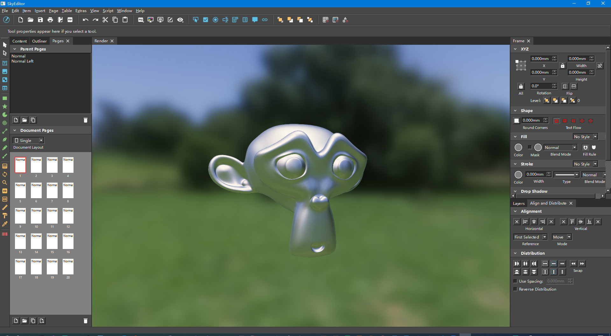


# SkyServer
### C++17 cross-platform realtime server
- Windows ubuntu测试通过
- CMake组织工程
- 工作在传输层/网络层(TCP/IP)
- Asio实现网络跨平台(IOCP/EPOLL)
- 同时支持TCP/WEBSOCKET连接
- Accept/NetIO线程可配置
- Protobuf格式网络协议
- MySQL存储冷数据
- Redis存储热数据
- Recast自动寻路
- Yaml格式配置
- 使用Curl进行HTTP访问
- 订阅发布模式消息分发器
### Screenshot
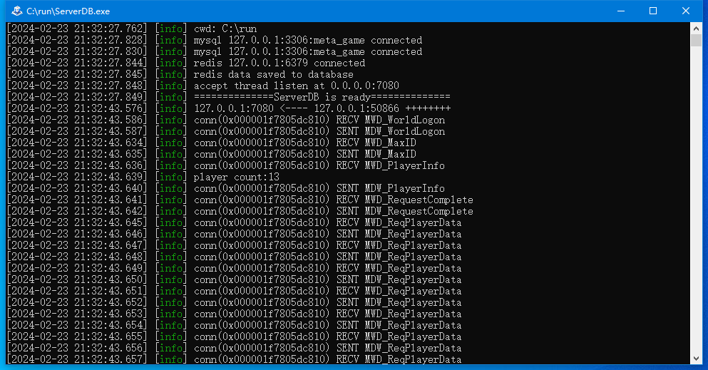
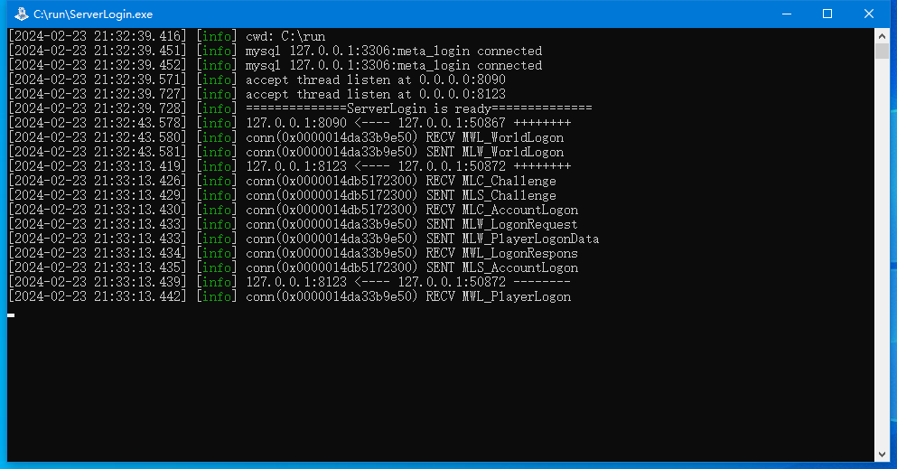
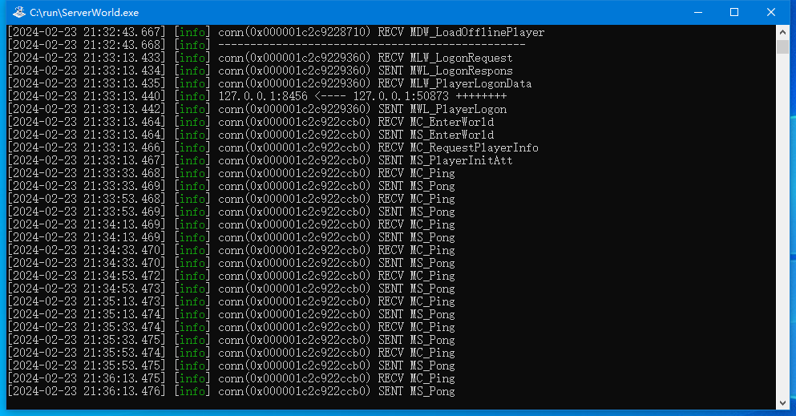
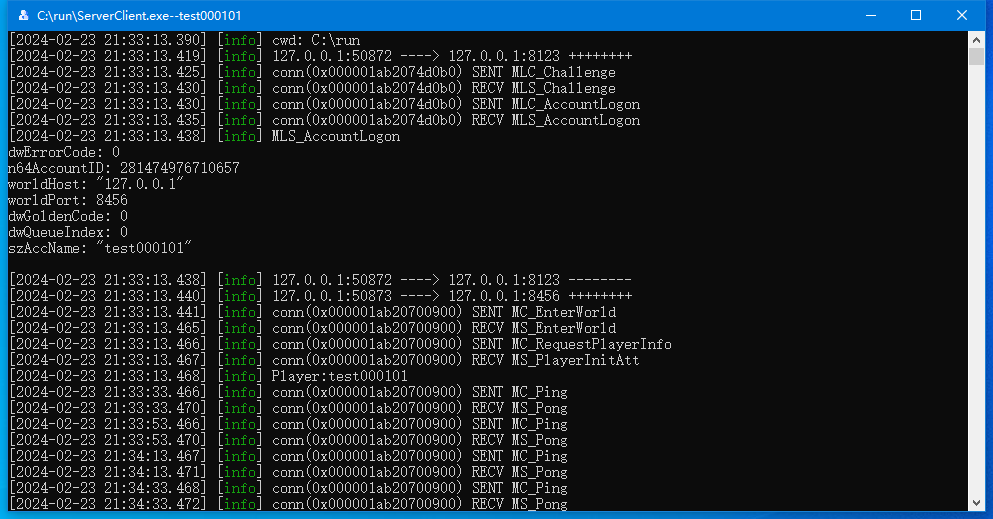
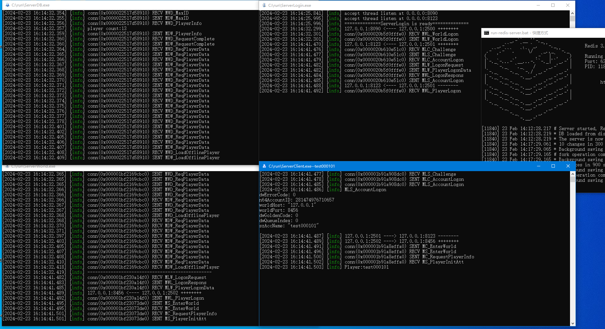
### Usage
- Run redis
- Run mysql
```
start ServerDB.exe
start ServerLogin.exe
start ServerWorld.exe
start ServerClient.exe
```


# 大主宰
### 支持Windows、Android、iOS多平台游戏
- C++98/Lua5.1.4
- 服务器基于IOCP
- 渲染Windows基于DirectX9，移动平台基于GLES2.0
- 自动更新
- 客户端逻辑Lua
### Screenshot


# UiEditor
### 数据驱动的UI编辑器
- 基于9个方向对齐的全平台屏幕适配方案
- 支持3D模型
- 支持Spine动画
### Screenshot

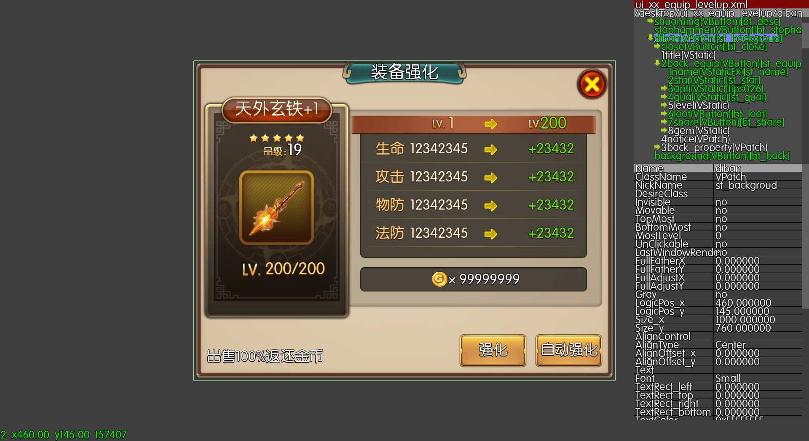


# Ares
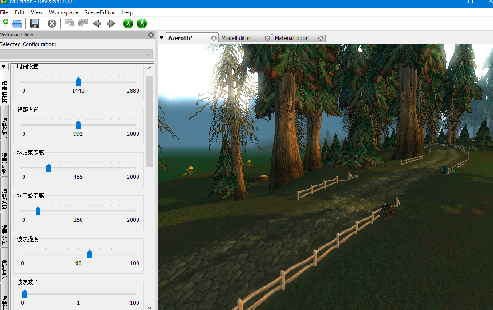
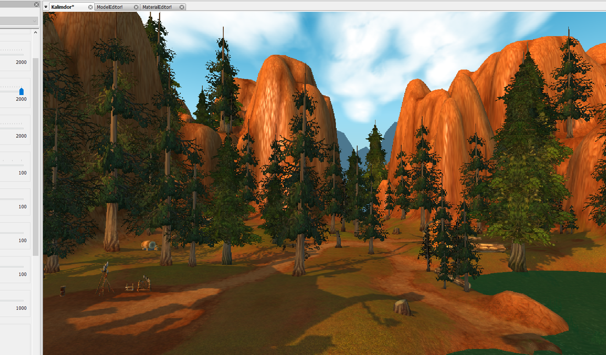
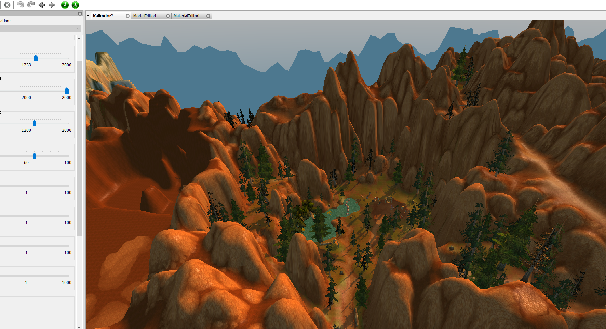
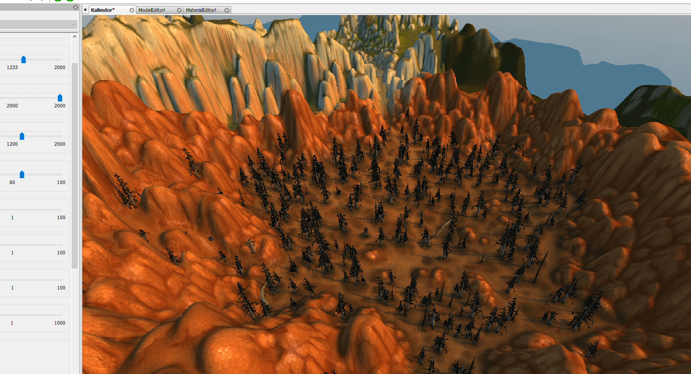
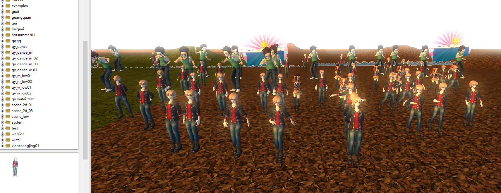


## 个人联系方式
##### 电话：(+86)18601672665 
##### 微信：18601672665 
##### QQ：305812109
##### Mail：xuebai5@qq.com
